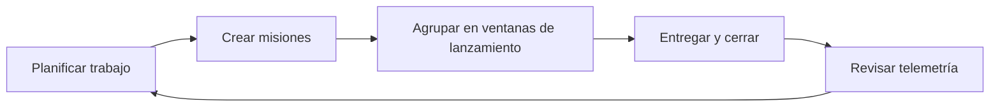

# Bienvenido a Orbitly

Orbitly es una plataforma ligera de seguimiento de proyectos para equipos que entregan rápido. Esta documentación cubre todo, desde tu primer proyecto hasta integraciones avanzadas con la API.


Orbitly es un producto ficticio con su propio sistema de marca. Este contenido es documentación de ejemplo para probar estructura, formato, navegación y flujos de trabajo de publicación.


## Tratamiento de la marca Orbitly

| Elemento | Estilo aplicado |
| --- | --- |
| Color primario | Azul Orbit `#2563EB` para enlaces, acciones y énfasis del producto |
| Color secundario | Cian Signal `#22D3EE` para líneas orbitales y resaltados |
| Color de acento | Ámbar Launch `#F59E0B` para momentos clave y énfasis positivo |
| Tono de fondo | Tinta Orbit `#111827` con superficies de nube y cielo |
| Sistema visual | Banner orbital ancho, logotipo Orbitly, tarjetas, pistas, pestañas y diagramas |
| Objetivo del contenido | Mostrar cómo la documentación del producto puede estructurarse para humanos y agentes de IA |

## Elige tu camino

<table data-view="cards"><thead><tr><th></th><th></th><th></th><th data-hidden data-card-target data-type="content-ref"></th></tr></thead><tbody>
<tr>
  <td><h3><i class="fa-bolt" style="color:$primary;">:bolt:</i></h3></td>
  <td><strong>Comienza rápido</strong></td>
  <td>Crea tu primer proyecto, añade misiones e invita a tu equipo.</td>
  <td><a href="getting-started/quickstart.md">Inicio rápido</a></td>
</tr>
<tr>
  <td><h3><i class="fa-diagram-project" style="color:$primary;">:diagram_project:</i></h3></td>
  <td><strong>Gestiona proyectos</strong></td>
  <td>Organiza proyectos, ventanas de lanzamiento, misiones y telemetría de entrega.</td>
  <td><a href="guides/projects.md">Proyectos y Misiones</a></td>
</tr>
<tr>
  <td><h3><i class="fa-plug" style="color:$primary;">:electric_plug:</i></h3></td>
  <td><strong>Conecta herramientas</strong></td>
  <td>Envía actualizaciones a Slack, vincula PRs de GitHub y conecta Figma.</td>
  <td><a href="guides/integrations.md">Integraciones</a></td>
</tr>
<tr>
  <td><h3><i class="fa-code" style="color:$primary;">:code:</i></h3></td>
  <td><strong>Construye con la API</strong></td>
  <td>Autentica, crea misiones, lee proyectos y maneja errores.</td>
  <td><a href="api-reference/authentication.md">Autenticación API</a></td>
</tr>
</tbody></table>

## ¿Qué es Orbitly?

Orbitly ayuda a los equipos a planificar, rastrear y entregar trabajo sin la carga de herramientas pesadas de gestión de proyectos. Las características principales incluyen:

* **Proyectos y Misiones** — organiza el trabajo en proyectos, desglósalo en misiones (tareas)
* **Ventanas de lanzamiento** — sprints ligeros con renovación automática
* **Telemetría** — paneles en tiempo real y gráficos de burndown
* **Integraciones** — Slack, GitHub, Figma y una API REST completa

## Cómo usan Orbitly los equipos

## ¿Necesitas ayuda?

Consulta las [Preguntas frecuentes](resources/faq.md) o envía un correo a support@orbitly.example.com.
