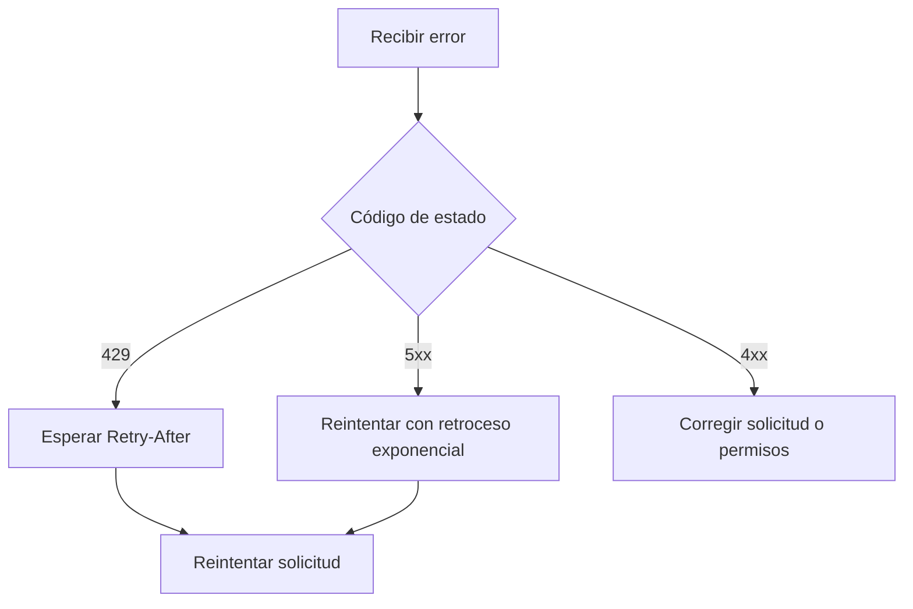

# Errores

La API utiliza códigos de estado HTTP convencionales y devuelve un cuerpo de error estructurado.

```json
{
  "error": {
    "code": "mission_not_found",
    "message": "No existe ninguna misión con ID ORB-999 en este espacio de trabajo.",
    "doc_url": "https://docs.orbitly.example.com/api-reference/errors"
  }
}
```

## Códigos de estado

| Código | Significado | ¿Reintentar? |
| ------ | ----------- | ------------ |
| `400`  | Cuerpo de la solicitud malformado o parámetros inválidos | No |
| `401`  | Token de API faltante o inválido | No |
| `403`  | Token válido pero sin permiso para este recurso | No |
| `404`  | El recurso no existe o no es visible para usted | No |
| `409`  | Conflicto, como prefijo de ID de misión duplicado | A veces |
| `422`  | Validación fallida; consulte `error.fields` para detalles | No |
| `429`  | Límite de tasa excedido; respete `Retry-After` | Sí |
| `500`  | Algo falló en nuestro lado | Sí |


Solo reintente automáticamente las respuestas `429` y `5xx`. Reintentar errores de validación o permisos usualmente genera más ruido sin corregir la solicitud.


## Errores de validación

Las respuestas `422` incluyen un desglose por campo:

```json
{
  "error": {
    "code": "validation_failed",
    "message": "Uno o más campos son inválidos.",
    "fields": {
      "fuel": "debe ser uno de: 1, 2, 3, 5, 8",
      "priority": "valor desconocido 'urgent'"
    }
  }
}
```

## Códigos de error comunes

<table data-view="cards">
  <thead>
    <tr>
      <th></th>
      <th></th>
    </tr>
  </thead>
  <tbody>
    <tr>
      <td><strong>`token_expired`</strong></td>
      <td>Rote el token en Configuración.</td>
    </tr>
    <tr>
      <td><strong>`workspace_suspended`</strong></td>
      <td>Resuelva el problema de facturación o contacte a un administrador del espacio de trabajo.</td>
    </tr>
    <tr>
      <td><strong>`mission_locked`</strong></td>
      <td>La misión está en una ventana de lanzamiento cerrada. Reabra la ventana o cree una misión de seguimiento.</td>
    </tr>
    <tr>
      <td><strong>`plan_limit_reached`</strong></td>
      <td>Actualice el plan o archive proyectos no usados.</td>
    </tr>
  </tbody>
</table>

## Patrón de reintento


