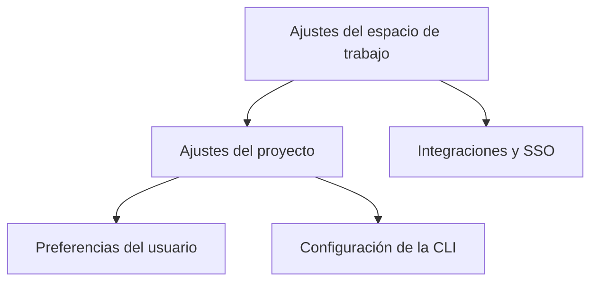

# Configuración

La configuración de Orbitly es por capas. Los ajustes del espacio de trabajo definen valores predeterminados compartidos, los ajustes del proyecto moldean cómo trabajan los equipos y las preferencias del usuario controlan las notificaciones personales.



## Ajustes del espacio de trabajo

Los administradores configuran los valores predeterminados a nivel de espacio de trabajo en **Settings > Workspace**.

| Ajuste | Qué controla | Valor predeterminado recomendado |
| ------- | ---------------- | ------------------- |
| Zona horaria predeterminada | Límites de la ventana de lanzamiento y cortes de informes | Zona horaria de la sede del equipo |
| Semana laboral | Días incluidos en la velocidad y burndown | De lunes a viernes |
| Prefijo de ID de misión | IDs de misión legibles para humanos | Prefijo corto de producto o equipo |
| SSO | Inicio de sesión SAML y controles de identidad | Espacios de trabajo empresariales |


Configura la zona horaria y la semana laboral antes de importar trabajo histórico. La telemetría se rellena según estos ajustes.


## Ajustes del proyecto

Cada proyecto tiene su propia página de ajustes para diseñar el flujo de trabajo diario.



### Flujo de trabajo

* Columnas del tablero
* Criterios de finalización
* Requisitos de revisión
* Reglas de asignación predeterminada



### Operaciones

* Plantillas de misión
* Automatizaciones
* Mapeo de canales de Slack
* Configuración de telemetría



## Configuración de la CLI

La CLI lee desde `~/.config/orbitly/config.toml`:

```toml
[core]
default_workspace = "acme-inc"
editor = "vim"

[output]
format = "table"   # table | json | csv
color = true

[aliases]
st = "mission list --mine --status open"
```

Las variables de entorno sobrescriben el archivo de configuración.

| Variable | Propósito |
| -------- | ------- |
| `ORBITLY_TOKEN` | Token API para autenticación |
| `ORBITLY_WORKSPACE` | Slug del espacio de trabajo predeterminado |
| `ORBITLY_API_URL` | Sobrescribir URL base de la API para entornos autoalojados |

<details>
<summary>Ejemplo de configuración para una pipeline de CI</summary>

```bash
export ORBITLY_WORKSPACE="acme-inc"
export ORBITLY_TOKEN="$ORBITLY_SERVICE_TOKEN"
orbitly mission list --status open --format json
```
</details>

## Preferencias del usuario

Cada usuario controla las notificaciones en **Settings > Notifications**.

| Canal | Mejor para | Configuración sugerida |
| ------- | -------- | ----------------- |
| En la app | Trabajo diario y revisiones | Mantener habilitado |
| DMs de Slack | Menciones y bloqueos urgentes | Habilitar solo menciones |
| Resumen por email | Resumen y ponerse al día | Resumen diario |
| Email por evento | Proyectos de bajo volumen | Deshabilitar para equipos ocupados |


Las preferencias de notificación no cambian la visibilidad del proyecto. Solo controlan dónde Orbitly envía actualizaciones para el trabajo al que ya tienes acceso.

