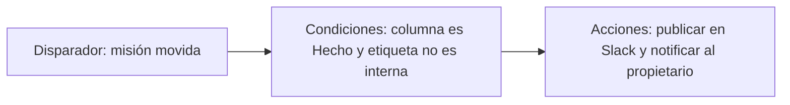

# Automatizaciones

Las automatizaciones eliminan la gestión repetitiva de tableros. Cada automatización es una **regla** compuesta por un disparador, condiciones opcionales y una o más acciones.


Las automatizaciones están disponibles en el plan Team y superiores. Los espacios de trabajo Explorer pueden crear 1 automatización por proyecto como prueba.


## Cómo funcionan las reglas

Las reglas se ejecutan en el orden listado en la página de **Automatizaciones**. Un solo evento puede coincidir con múltiples reglas, así que mantén los nombres explícitos y usa condiciones para evitar solapamientos.

## Biblioteca de automatizaciones

<table data-view="cards">
  <thead>
    <tr>
      <th width="48"></th>
      <th></th>
      <th></th>
      <th data-hidden data-card-target data-type="content-ref"></th>
    </tr>
  </thead>
  <tbody>
    <tr>
      <td><i class="fa-list-check"></i></td>
      <td><strong>Reglas y disparadores</strong></td>
      <td>Todos los disparadores, condiciones, acciones y comportamientos de ejecución disponibles.</td>
      <td><a href="rules.md">reglas</a></td>
    </tr>
    <tr>
      <td><i class="fa-wand-magic-sparkles"></i></td>
      <td><strong>Recetas de ejemplo</strong></td>
      <td>Flujos de trabajo para copiar y pegar sobre bugs, lanzamientos, revisiones obsoletas y reportes.</td>
      <td><a href="examples.md">ejemplos</a></td>
    </tr>
  </tbody>
</table>

## Lista de verificación de diseño



## Comienza con un resultado de negocio

Nombra el comportamiento claramente, como "Escalar revisiones obsoletas" o "Notificar al canal de lanzamiento cuando se envíe trabajo grande".



## Elige el disparador más específico

Prefiere un disparador específico como `Review requested` en lugar de uno amplio como `Mission updated`.



## Añade condiciones de protección

Filtra por proyecto, etiqueta, prioridad, equipo o ventana de lanzamiento para que la regla se active solo cuando debe hacerlo.



## Prueba en el historial

Usa **Automatizaciones > Historial** para confirmar si las ejecuciones se realizaron, omitieron o fallaron.




Las automatizaciones pueden activar otras automatizaciones, pero las cadenas están limitadas a 5 saltos para evitar bucles.

