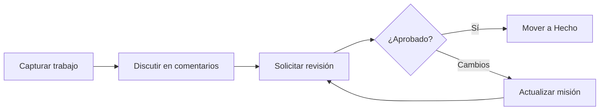

# Colaboración

Orbitly está construido alrededor del trabajo compartido: misiones, ventanas de lanzamiento, revisiones y el contexto que las rodea. Los mejores equipos usan las funciones de colaboración para dejar clara la propiedad sin crear ruido de notificaciones.

## Modelo de colaboración

## Comentarios y menciones

Cada misión tiene un hilo de comentarios. Usa `@name` para mencionar a un compañero cuando necesites acción o contexto.

Los comentarios soportan:

* Formato Markdown
* Bloques de código
* Adjuntos de archivos hasta 25 MB
* Enlaces a otras misiones, proyectos y ventanas de lanzamiento


Usa los comentarios para decisiones y contexto duradero. Usa herramientas de chat para intercambios rápidos que no necesitan quedar con la misión.


## Revisiones

Usa revisiones cuando el trabajo necesite aprobación explícita antes de pasar a Hecho.



## Solicitar una revisión

Abre la misión y haz clic en **Solicitar revisión**.



## Elegir revisores

Selecciona uno o más compañeros. Orbitly les notifica a través de su canal preferido.



## Resolver la decisión

Los revisores pueden **Aprobar** o **Solicitar cambios**. Las misiones con revisiones pendientes muestran una insignia de revisión en el tablero.



## Vistas compartidas

Guarda vistas filtradas del tablero para flujos de trabajo recurrentes del equipo.

<table data-view="cards">
  <thead>
    <tr>
      <th></th>
      <th></th>
      <th></th>
    </tr>
  </thead>
  <tbody>
    <tr>
      <td><strong>Mis misiones abiertas</strong></td>
      <td>`assignee:me status:open`</td>
      <td>Vista personal de ejecución</td>
    </tr>
    <tr>
      <td><strong>Lanzamientos de esta semana</strong></td>
      <td>`window:current status:done`</td>
      <td>Revisión de entrega</td>
    </tr>
    <tr>
      <td><strong>Trabajo bloqueado</strong></td>
      <td>`label:blocked`</td>
      <td>Reunión diaria del equipo</td>
    </tr>
  </tbody>
</table>

## Notificaciones

Por defecto, Orbitly te notifica cuando:

* Eres mencionado o asignado
* Una misión que posees cambia de estado
* Se te solicita una revisión
* Una misión que sigues recibe un nuevo comentario

Configura esto por proyecto en **Configuración > Notificaciones**. Para proyectos con mucha actividad, usa el **Resumen diario** y mantén alertas instantáneas solo para menciones y solicitudes de revisión.

## Acceso de invitados

Invita a clientes, contratistas y colaboradores externos como **Invitados**. Los invitados solo ven los proyectos a los que se les añade explícitamente y nunca ven la configuración a nivel de espacio de trabajo ni las listas de miembros.


Antes de añadir un invitado, verifica que las plantillas de proyecto, comentarios y adjuntos no incluyan información solo interna.

