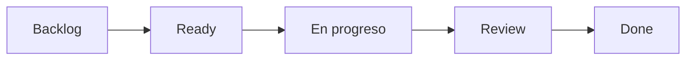

# Paneles y métricas

Los paneles de Telemetría están diseñados para revisiones operativas semanales. Usa los gráficos juntos: la velocidad te dice qué se entregó, el tiempo de ciclo muestra cuánto tardó, y el flujo acumulativo revela dónde está atascado el trabajo.

## Velocidad

Total de fuel completado por ventana de lanzamiento, con un promedio móvil de 3 ventanas. Se excluyen las misiones depuradas.


Un promedio móvil estable es más útil que una única ventana de lanzamiento heroica. Busca un rendimiento repetible.


## Burndown

Fuel restante en la ventana actual, día a día, contra una línea ideal. Se excluyen los fines de semana si tu semana laboral está configurada (ver [Configuración](../../getting-started/configuration.md)).

## Tiempo de ciclo

Tiempo desde **En progreso** hasta **Hecho**, mostrado como un diagrama de dispersión con bandas p50/p85.

| Percentil | Rango saludable |
| ---------- | --------------- |
| p50 | 3 días o menos |
| p85 | 7 días o menos |

## Flujo acumulativo

Gráfico de área apilada de conteos de misiones por columna a lo largo del tiempo. Bandas que se ensanchan indican cuellos de botella.

Cómo interpretar una banda que se ensancha

Si la banda de **En revisión** crece durante varios días mientras **Hecho** se mantiene estable, es probable que los revisores sean el cuello de botella. Añade capacidad de revisión, divide misiones grandes o usa una automatización para escalar revisiones estancadas.

## Exportación

Cada gráfico se puede exportar como PNG o CSV. Los paneles pueden compartirse con un enlace público de solo lectura en planes Enterprise.


Cambiar las asignaciones de columnas del flujo de trabajo recalcula todas las métricas históricas. Espera que los paneles cambien después de reasignar.

