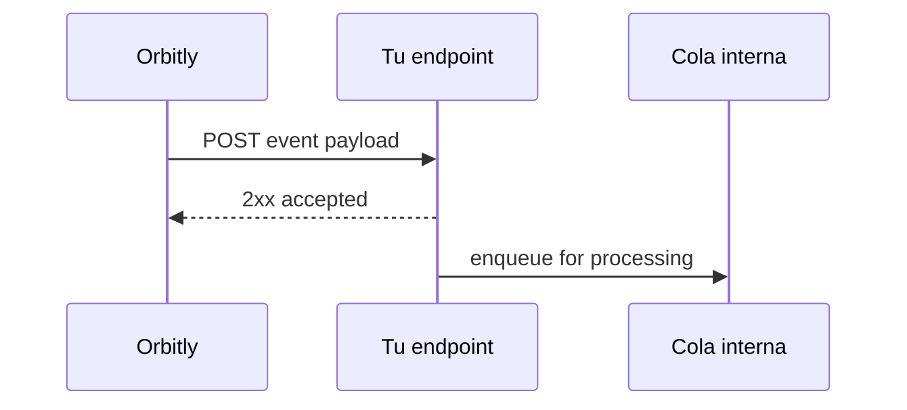

# Webhooks

Los webhooks envían callbacks HTTP en tiempo real cuando ocurren eventos en Orbitly. Úsalos para actualizar paneles internos, activar sistemas posteriores o almacenar eventos de entrega en tu almacén de datos.



## Crear un webhook



## Abrir webhooks

Ve a **Settings > Webhooks** y haz clic en **New Webhook**.



## Añadir el endpoint

Introduce una URL HTTPS que pueda recibir solicitudes `POST`.



## Elegir eventos

Suscríbete a uno o más tipos de eventos, como `mission.created` o `window.closed`.



## Guardar el secreto

Usa el secreto generado para verificar la firma de cada entrega.



## Tipos de eventos

| Evento | Se dispara cuando |
| ------ | ----------------- |
| `mission.created` | Se crea una nueva misión |
| `mission.updated` | Cambia cualquier campo de la misión |
| `mission.status_changed` | Una misión se mueve entre columnas |
| `window.opened` | Comienza una ventana de lanzamiento |
| `window.closed` | Termina una ventana de lanzamiento |
| `comment.created` | Se publica un comentario |

## Formato del payload

```json
{
  "event": "mission.status_changed",
  "timestamp": "2026-07-02T14:30:00Z",
  "workspace": "acme-inc",
  "data": {
    "mission_id": "ORB-142",
    "title": "Rediseñar flujo de pago",
    "from_status": "in_progress",
    "to_status": "done",
    "actor": "usr_8f3ka92"
  }
}
```

## Verificar firmas

Cada solicitud incluye un encabezado `X-Orbitly-Signature`. Es un digest HMAC-SHA256 del cuerpo bruto de la solicitud usando tu secreto de webhook.



```python
import hmac
import hashlib

def verify(body: bytes, signature: str, secret: str) -> bool:
    expected = hmac.new(secret.encode(), body, hashlib.sha256).hexdigest()
    return hmac.compare_digest(expected, signature)
```



```javascript
import crypto from "node:crypto";

export function verify(body, signature, secret) {
  const expected = crypto
    .createHmac("sha256", secret)
    .update(body)
    .digest("hex");

  return crypto.timingSafeEqual(Buffer.from(expected), Buffer.from(signature));
}
```




Verifica el cuerpo bruto de la solicitud antes de parsear JSON. Re-serializar JSON parseado puede cambiar espacios en blanco y producir una firma diferente.


## Reintentos

Las entregas fallidas se reintentan con retroceso exponencial.

| Intento | Retraso |
| ------- | ------- |
| 1 | 1 minuto |
| 2 | 5 minutos |
| 3 | 30 minutos |
| 4 | 2 horas |
| 5 | 12 horas |

Después de 5 fallos, Orbitly pausa el webhook y notifica a los administradores del workspace.
