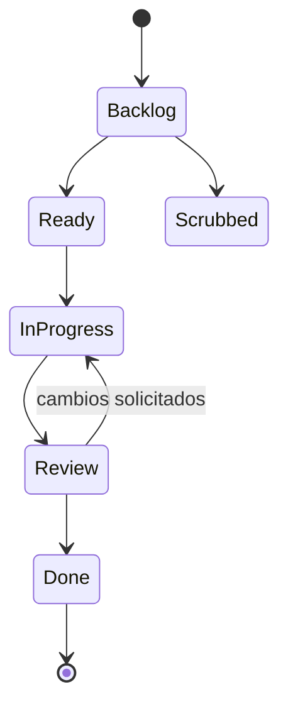

# Glosario

Utilice este glosario al leer la documentación de Orbitly, revisar análisis o construir integraciones.

## Modelo de producto

| Término | Definición |
| ---- | ---------- |
| **Workspace** | Contenedor de nivel superior para todos los proyectos, miembros y configuraciones |
| **Project** | Un área de workspace que contiene misiones, flujos de trabajo, vistas, automatizaciones y telemetría |
| **Mission** | Una unidad de trabajo única, similar a una tarea o ticket |
| **Sub-mission** | Una tarea hija anidada bajo una misión principal |
| **Guest** | Colaborador externo con acceso limitado a proyectos específicos |
| **Service account** | Un miembro no humano usado para automatizaciones API |

## Términos de flujo de trabajo

| Término | Definición |
| ---- | ---------- |
| **Launch window** | Un sprint con tiempo limitado; las misiones no terminadas se trasladan cuando cierra |
| **Fuel** | Estimación de esfuerzo en puntos: 1, 2, 3, 5 u 8 |
| **Scrubbed** | Una misión cancelada, excluida de todas las métricas |
| **Review** | Un paso de aprobación requerido antes de que el trabajo pueda marcarse como Hecho |
| **Shared view** | Un filtro guardado visible para los miembros del proyecto |

## Términos de telemetría

| Término | Definición |
| ---- | ---------- |
| **Telemetry** | Suite de informes de Orbitly: velocidad, burndown, tiempo de ciclo y flujo acumulativo |
| **Velocity** | Total de fuel completado por ventana de lanzamiento, promediado en las últimas 3 ventanas |
| **Cycle time** | Tiempo desde que una misión entra en In Progress hasta alcanzar Done |
| **Burndown** | Fuel restante en la ventana de lanzamiento actual a lo largo del tiempo |
| **Cumulative flow** | Un gráfico que muestra el conteo de misiones por columna del flujo de trabajo a lo largo del tiempo |

## Términos de API

| Término | Definición |
| ---- | ---------- |
| **Live token** | Token API para workspaces de producción |
| **Test token** | Token API para workspaces sandbox |
| **Webhook** | Un callback HTTP enviado cuando ocurre un evento de Orbitly |
| **Rate limit** | El número máximo de solicitudes API permitidas por minuto |

Cómo se mueve el trabajo de Orbitly a través de un proyecto

