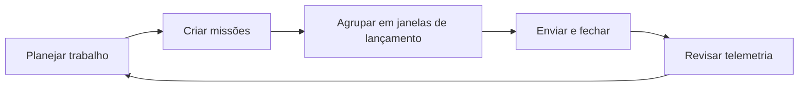

# Bem-vindo ao Orbitly

Orbitly é uma plataforma leve de acompanhamento de projetos para equipes que entregam rápido. Esta documentação cobre tudo, desde seu primeiro projeto até integrações avançadas de API.


Orbitly é um produto fictício com seu próprio sistema de marca. Este conteúdo é uma documentação de exemplo para testar estrutura, formatação, navegação e fluxos de publicação.


## Tratamento da marca Orbitly

| Elemento | Estilo aplicado |
| --- | --- |
| Cor primária | Azul Orbit `#2563EB` para links, ações e ênfase no produto |
| Cor secundária | Ciano Signal `#22D3EE` para linhas orbitais e destaques |
| Cor de destaque | Âmbar Launch `#F59E0B` para momentos-chave e ênfase positiva |
| Tom de fundo | Tinta Orbit `#111827` com superfícies de nuvem e céu |
| Sistema visual | Banner orbital amplo, logotipo Orbitly, cards, dicas, abas e diagramas |
| Objetivo do conteúdo | Mostrar como a documentação do produto pode ser estruturada para humanos e agentes de IA |

## Escolha seu caminho

<table data-view="cards"><thead><tr><th></th><th></th><th></th><th data-hidden data-card-target data-type="content-ref"></th></tr></thead><tbody>
<tr>
  <td><h3><i class="fa-bolt" style="color:$primary;">:bolt:</i></h3></td>
  <td><strong>Comece rápido</strong></td>
  <td>Crie seu primeiro projeto, adicione missões e convide sua equipe.</td>
  <td><a href="getting-started/quickstart.md">Início rápido</a></td>
</tr>
<tr>
  <td><h3><i class="fa-diagram-project" style="color:$primary;">:diagram_project:</i></h3></td>
  <td><strong>Gerencie projetos</strong></td>
  <td>Organize projetos, janelas de lançamento, missões e telemetria de entrega.</td>
  <td><a href="guides/projects.md">Projetos & Missões</a></td>
</tr>
<tr>
  <td><h3><i class="fa-plug" style="color:$primary;">:electric_plug:</i></h3></td>
  <td><strong>Conecte ferramentas</strong></td>
  <td>Envie atualizações para Slack, vincule PRs do GitHub e conecte Figma.</td>
  <td><a href="guides/integrations.md">Integrações</a></td>
</tr>
<tr>
  <td><h3><i class="fa-code" style="color:$primary;">:code:</i></h3></td>
  <td><strong>Construa com a API</strong></td>
  <td>Autentique, crie missões, leia projetos e trate erros.</td>
  <td><a href="api-reference/authentication.md">Autenticação da API</a></td>
</tr>
</tbody></table>

## O que é o Orbitly?

Orbitly ajuda equipes a planejar, acompanhar e entregar trabalho sem o peso de ferramentas pesadas de gerenciamento de projetos. As principais funcionalidades incluem:

* **Projetos & Missões** — organize o trabalho em projetos, divida em missões (tarefas)
* **Janelas de lançamento** — sprints leves com rollover automático
* **Telemetria** — painéis em tempo real e gráficos de burndown
* **Integrações** — Slack, GitHub, Figma e uma API REST completa

## Como as equipes usam o Orbitly

## Precisa de ajuda?

Consulte o [FAQ](resources/faq.md) ou envie um e-mail para support@orbitly.example.com.
