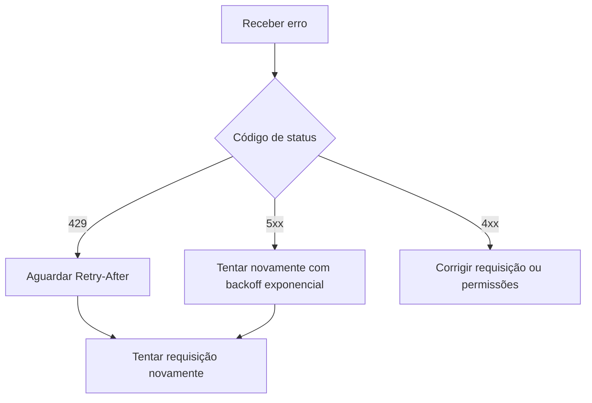

# Erros

A API utiliza códigos de status HTTP convencionais e retorna um corpo de erro estruturado.

```json
{
  "error": {
    "code": "mission_not_found",
    "message": "Nenhuma missão com ID ORB-999 existe neste workspace.",
    "doc_url": "https://docs.orbitly.example.com/api-reference/errors"
  }
}
```

## Códigos de status

| Código | Significado | Nova tentativa? |
| ------ | ----------- | -------------- |
| `400`  | Corpo da requisição malformado ou parâmetros inválidos | Não |
| `401`  | Token da API ausente ou inválido | Não |
| `403`  | Token válido, mas sem permissão para este recurso | Não |
| `404`  | Recurso não existe ou não está visível para você | Não |
| `409`  | Conflito, como prefixo de ID de missão duplicado | Às vezes |
| `422`  | Validação falhou; veja `error.fields` para detalhes | Não |
| `429`  | Limite de taxa excedido; respeite `Retry-After` | Sim |
| `500`  | Algo quebrou do nosso lado | Sim |


Somente faça nova tentativa automática para respostas `429` e `5xx`. Repetir erros de validação ou permissão geralmente gera mais ruído sem corrigir a requisição.


## Erros de validação

Respostas `422` incluem um detalhamento por campo:

```json
{
  "error": {
    "code": "validation_failed",
    "message": "Um ou mais campos são inválidos.",
    "fields": {
      "fuel": "deve ser um dos seguintes: 1, 2, 3, 5, 8",
      "priority": "valor desconhecido 'urgent'"
    }
  }
}
```

## Códigos de erro comuns

<table data-view="cards">
  <thead>
    <tr>
      <th></th>
      <th></th>
    </tr>
  </thead>
  <tbody>
    <tr>
      <td><strong>`token_expired`</strong></td>
      <td>Roteie o token em Settings.</td>
    </tr>
    <tr>
      <td><strong>`workspace_suspended`</strong></td>
      <td>Resolva o problema de cobrança ou contate um administrador do workspace.</td>
    </tr>
    <tr>
      <td><strong>`mission_locked`</strong></td>
      <td>A missão está em uma janela de lançamento fechada. Reabra a janela ou crie uma missão de acompanhamento.</td>
    </tr>
    <tr>
      <td><strong>`plan_limit_reached`</strong></td>
      <td>Faça upgrade do plano ou arquive projetos não utilizados.</td>
    </tr>
  </tbody>
</table>

## Padrão de nova tentativa


