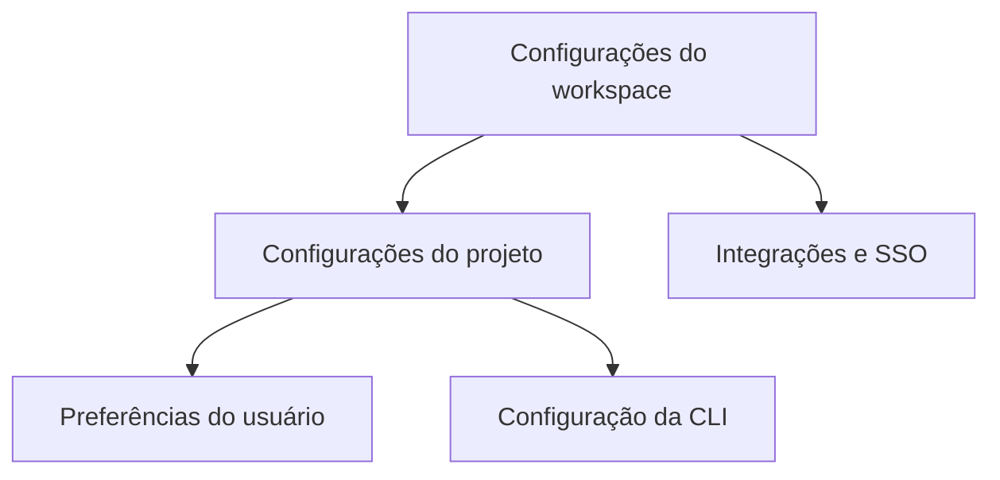

# Configuração

A configuração do Orbitly é em camadas. As configurações do workspace definem padrões compartilhados, as configurações do projeto moldam como as equipes trabalham, e as preferências do usuário controlam notificações pessoais.



## Configurações do workspace

Admins configuram padrões para todo o workspace em **Settings > Workspace**.

| Configuração | O que controla | Padrão recomendado |
| ------------ | -------------- | ------------------ |
| Fuso horário padrão | Limites da janela de lançamento e cortes de relatórios | Fuso horário da sede da equipe |
| Semana de trabalho | Dias incluídos na velocidade e burndown | Segunda a sexta-feira |
| Prefixo do ID da missão | IDs de missão legíveis | Prefixo curto do produto ou equipe |
| SSO | Login SAML e controles de identidade | Workspaces empresariais |


Defina o fuso horário e a semana de trabalho antes de importar trabalhos históricos. A telemetria será preenchida com base nessas configurações.


## Configurações do projeto

Cada projeto tem sua própria página de configurações para o design do fluxo de trabalho diário.



### Fluxo de trabalho

* Colunas do quadro
* Critérios de conclusão
* Requisitos de revisão
* Regras padrão de atribuição



### Operações

* Modelos de missão
* Automações
* Mapeamento de canais Slack
* Configuração de telemetria



## Configuração da CLI

A CLI lê de `~/.config/orbitly/config.toml`:

```toml
[core]
default_workspace = "acme-inc"
editor = "vim"

[output]
format = "table"   # table | json | csv
color = true

[aliases]
st = "mission list --mine --status open"
```

Variáveis de ambiente sobrescrevem o arquivo de configuração.

| Variável | Propósito |
| -------- | --------- |
| `ORBITLY_TOKEN` | Token da API para autenticação |
| `ORBITLY_WORKSPACE` | Slug do workspace padrão |
| `ORBITLY_API_URL` | Sobrescreve a URL base da API para ambientes self-hosted |

<details>
<summary>Exemplo de configuração para pipeline CI</summary>

```bash
export ORBITLY_WORKSPACE="acme-inc"
export ORBITLY_TOKEN="$ORBITLY_SERVICE_TOKEN"
orbitly mission list --status open --format json
```
</details>

## Preferências do usuário

Cada usuário controla notificações em **Settings > Notifications**.

| Canal | Melhor para | Configuração sugerida |
| ----- | ----------- | --------------------- |
| In-app | Trabalho diário e revisões | Manter ativado |
| DMs no Slack | Menções e bloqueios urgentes | Ativar apenas menções |
| Resumo por email | Resumo e atualização | Resumo diário |
| Email por evento | Projetos de baixo volume | Desativar para equipes ocupadas |


Preferências de notificação não alteram a visibilidade do projeto. Elas apenas controlam onde o Orbitly envia atualizações para trabalhos que você já pode acessar.

