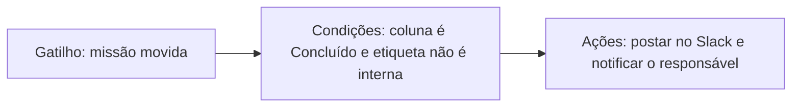

# Automações

Automações eliminam a gestão repetitiva de quadros. Cada automação é uma **regra** composta por um gatilho, condições opcionais e uma ou mais ações.


Automações estão disponíveis no plano Team e superiores. Espaços de trabalho Explorer podem criar 1 automação por projeto como teste.


## Como as regras funcionam

As regras são executadas na ordem listada na página **Automações**. Um único evento pode corresponder a várias regras, então mantenha os nomes explícitos e use condições para evitar sobreposição.

## Biblioteca de automações

<table data-view="cards">
  <thead>
    <tr>
      <th width="48"></th>
      <th></th>
      <th></th>
      <th data-hidden data-card-target data-type="content-ref"></th>
    </tr>
  </thead>
  <tbody>
    <tr>
      <td><i class="fa-list-check"></i></td>
      <td><strong>Regras e gatilhos</strong></td>
      <td>Todos os gatilhos, condições, ações e comportamentos de execução disponíveis.</td>
      <td><a href="rules.md">regras</a></td>
    </tr>
    <tr>
      <td><i class="fa-wand-magic-sparkles"></i></td>
      <td><strong>Receitas de exemplo</strong></td>
      <td>Fluxos de trabalho para bugs, lançamentos, revisões antigas e relatórios para copiar e colar.</td>
      <td><a href="examples.md">exemplos</a></td>
    </tr>
  </tbody>
</table>

## Checklist de design



## Comece com um resultado de negócio

Nomeie o comportamento claramente, como "Escalar revisões antigas" ou "Notificar canal de lançamento quando trabalho grande for enviado".



## Escolha o gatilho mais específico

Prefira um gatilho específico como `Review requested` em vez de um gatilho amplo como `Mission updated`.



## Adicione condições de proteção

Filtre por projeto, etiqueta, prioridade, equipe ou janela de lançamento para que a regra dispare somente quando necessário.



## Teste no histórico

Use **Automações > Histórico** para confirmar se execuções foram realizadas, puladas ou falharam.




Automações podem disparar outras automações, mas cadeias são limitadas a 5 saltos para evitar loops.

