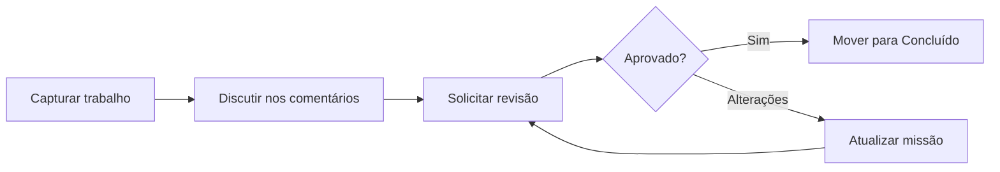

# Colaboração

Orbitly é construído em torno do trabalho compartilhado: missões, janelas de lançamento, revisões e o contexto ao redor deles. As melhores equipes usam recursos de colaboração para deixar a propriedade clara sem criar ruído de notificações.

## Modelo de colaboração

## Comentários e menções

Cada missão tem um tópico de comentários. Use `@name` para mencionar um colega quando precisar de ação ou contexto.

Os comentários suportam:

* Formatação Markdown
* Blocos de código
* Anexos de arquivos de até 25 MB
* Links para outras missões, projetos e janelas de lançamento


Use comentários para decisões e contexto duradouro. Use ferramentas de chat para trocas rápidas que não precisam ficar vinculadas à missão.


## Revisões

Use revisões quando o trabalho precisar de aprovação explícita antes de ser movido para Concluído.



## Solicitar uma revisão

Abra a missão e clique em **Solicitar Revisão**.



## Escolher revisores

Selecione um ou mais colegas. Orbitly os notifica pelo canal preferido.



## Resolver a decisão

Os revisores podem **Aprovar** ou **Solicitar Alterações**. Missões com revisões pendentes mostram um selo de revisão no quadro.



## Visualizações compartilhadas

Salve visualizações filtradas do quadro para fluxos de trabalho recorrentes da equipe.

<table data-view="cards">
  <thead>
    <tr>
      <th></th>
      <th></th>
      <th></th>
    </tr>
  </thead>
  <tbody>
    <tr>
      <td><strong>Minhas missões abertas</strong></td>
      <td>`assignee:me status:open`</td>
      <td>Visualização pessoal de execução</td>
    </tr>
    <tr>
      <td><strong>Lançamentos desta semana</strong></td>
      <td>`window:current status:done`</td>
      <td>Revisão de entrega</td>
    </tr>
    <tr>
      <td><strong>Trabalho bloqueado</strong></td>
      <td>`label:blocked`</td>
      <td>Reunião diária da equipe</td>
    </tr>
  </tbody>
</table>

## Notificações

Por padrão, Orbitly notifica você quando:

* Você é mencionado ou designado
* Uma missão que você possui muda de status
* Uma revisão é solicitada a você
* Uma missão que você acompanha recebe um novo comentário

Ajuste isso por projeto em **Configurações > Notificações**. Para projetos movimentados, use o **Resumo Diário** e mantenha alertas instantâneos apenas para menções e solicitações de revisão.

## Acesso de convidados

Convide clientes, contratados e colaboradores externos como **Convidados**. Convidados veem apenas os projetos aos quais são explicitamente adicionados e nunca veem configurações do espaço de trabalho ou listas de membros.


Antes de adicionar um convidado, verifique se os modelos de projeto, comentários e anexos não incluem informações exclusivas para uso interno.

