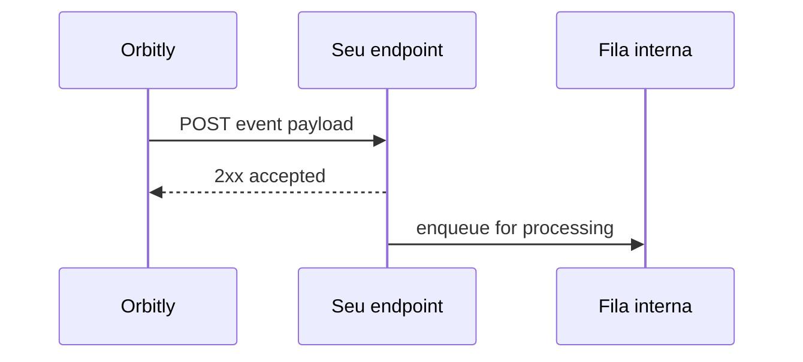

# Webhooks

Webhooks enviam callbacks HTTP em tempo real quando algo acontece no Orbitly. Use-os para atualizar painéis internos, acionar sistemas downstream ou armazenar eventos de entrega no seu data warehouse.



## Criar um webhook



## Abrir webhooks

Vá para **Configurações > Webhooks** e clique em **Novo Webhook**.



## Adicionar o endpoint

Digite uma URL HTTPS que possa receber requisições `POST`.



## Escolher eventos

Assine um ou mais tipos de evento, como `mission.created` ou `window.closed`.



## Salvar o segredo

Use o segredo gerado para verificar a assinatura de cada entrega.



## Tipos de evento

| Evento | Disparado quando |
| ------ | ---------------- |
| `mission.created` | Uma nova missão é criada |
| `mission.updated` | Qualquer campo da missão é alterado |
| `mission.status_changed` | Uma missão se move entre colunas |
| `window.opened` | Uma janela de lançamento começa |
| `window.closed` | Uma janela de lançamento termina |
| `comment.created` | Um comentário é postado |

## Formato do payload

```json
{
  "event": "mission.status_changed",
  "timestamp": "2026-07-02T14:30:00Z",
  "workspace": "acme-inc",
  "data": {
    "mission_id": "ORB-142",
    "title": "Redesign checkout flow",
    "from_status": "in_progress",
    "to_status": "done",
    "actor": "usr_8f3ka92"
  }
}
```

## Verificar assinaturas

Cada requisição inclui um cabeçalho `X-Orbitly-Signature`. É um digest HMAC-SHA256 do corpo bruto da requisição usando seu segredo do webhook.



```python
import hmac
import hashlib

def verify(body: bytes, signature: str, secret: str) -> bool:
    expected = hmac.new(secret.encode(), body, hashlib.sha256).hexdigest()
    return hmac.compare_digest(expected, signature)
```



```javascript
import crypto from "node:crypto";

export function verify(body, signature, secret) {
  const expected = crypto
    .createHmac("sha256", secret)
    .update(body)
    .digest("hex");

  return crypto.timingSafeEqual(Buffer.from(expected), Buffer.from(signature));
}
```




Verifique o corpo bruto da requisição antes de analisar o JSON. Re-serializar o JSON analisado pode alterar espaços em branco e produzir uma assinatura diferente.


## Retentativas

Entregas falhadas são retentadas com backoff exponencial.

| Tentativa | Atraso |
| --------- | ------ |
| 1 | 1 minuto |
| 2 | 5 minutos |
| 3 | 30 minutos |
| 4 | 2 horas |
| 5 | 12 horas |

Após 5 falhas, o Orbitly pausa o webhook e notifica os administradores do workspace.
