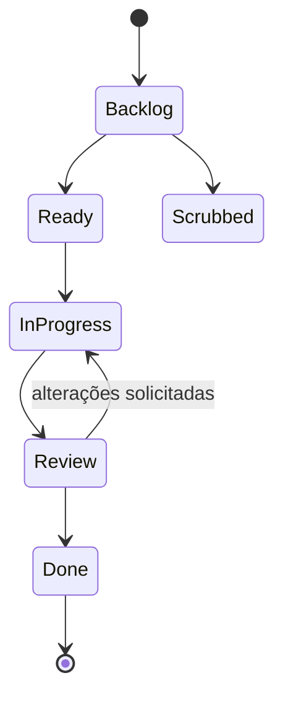

# Glossário

Use este glossário ao ler a documentação do Orbitly, revisar análises ou construir integrações.

## Modelo de produto

| Termo | Definição |
| ---- | ---------- |
| **Workspace** | Contêiner de nível superior para todos os projetos, membros e configurações |
| **Project** | Uma área do workspace que contém missões, fluxos de trabalho, visualizações, automações e telemetria |
| **Mission** | Uma unidade única de trabalho, semelhante a uma tarefa ou ticket |
| **Sub-mission** | Uma tarefa filha aninhada sob uma missão pai |
| **Guest** | Colaborador externo com acesso limitado a projetos específicos |
| **Service account** | Um membro não humano usado para automações via API |

## Termos de fluxo de trabalho

| Termo | Definição |
| ---- | ---------- |
| **Launch window** | Um sprint com tempo limitado; missões não concluídas são transferidas quando ele fecha |
| **Fuel** | Estimativa de esforço em pontos: 1, 2, 3, 5 ou 8 |
| **Scrubbed** | Uma missão cancelada, excluída de todas as métricas |
| **Review** | Uma etapa de aprovação obrigatória antes que o trabalho possa ser marcado como Concluído |
| **Shared view** | Um filtro salvo visível para membros do projeto |

## Termos de telemetria

| Termo | Definição |
| ---- | ---------- |
| **Telemetry** | Conjunto de relatórios do Orbitly: velocidade, burndown, tempo de ciclo e fluxo cumulativo |
| **Velocity** | Total de fuel concluído por launch window, calculado como média das últimas 3 janelas |
| **Cycle time** | Tempo desde que uma missão entra em In Progress até atingir Done |
| **Burndown** | Fuel restante na launch window atual ao longo do tempo |
| **Cumulative flow** | Um gráfico mostrando a contagem de missões por coluna do fluxo de trabalho ao longo do tempo |

## Termos de API

| Termo | Definição |
| ---- | ---------- |
| **Live token** | Token de API para workspaces de produção |
| **Test token** | Token de API para workspaces sandbox |
| **Webhook** | Um callback HTTP enviado quando um evento do Orbitly ocorre |
| **Rate limit** | O número máximo de requisições API permitidas por minuto |

Como o trabalho do Orbitly se move através de um projeto

