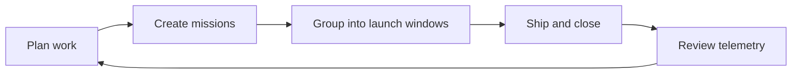

# Welcome to Orbitly

Orbitly is a lightweight project tracking platform for teams that ship fast. This documentation covers everything from your first project to advanced API integrations.


Orbitly is a fictional product presented with GitBook branding. This content is dummy documentation for testing GitBook structure, formatting, navigation, and publishing workflows.


## GitBook demo treatment

| Element | Applied style |
| --- | --- |
| Primary color | GitBook orange `#F25B3A` for accents and actions |
| Background tone | GitBook dark base `#1C1917` with neutral greys |
| Visual system | Wide banner, wordmark, cards, hints, tabs, and diagrams |
| Content goal | Show how product docs can be structured for humans and AI agents |

## Choose your path

<table data-view="cards"><thead><tr><th></th><th></th><th></th><th data-hidden data-card-target data-type="content-ref"></th></tr></thead><tbody>
<tr>
  <td><h3><i class="fa-bolt" style="color:$primary;">:bolt:</i></h3></td>
  <td><strong>Start fast</strong></td>
  <td>Create your first project, add missions, and invite your team.</td>
  <td><a href="getting-started/quickstart.md">Quickstart</a></td>
</tr>
<tr>
  <td><h3><i class="fa-diagram-project" style="color:$primary;">:diagram_project:</i></h3></td>
  <td><strong>Run projects</strong></td>
  <td>Organize projects, launch windows, missions, and delivery telemetry.</td>
  <td><a href="guides/projects.md">Projects & Missions</a></td>
</tr>
<tr>
  <td><h3><i class="fa-plug" style="color:$primary;">:electric_plug:</i></h3></td>
  <td><strong>Connect tools</strong></td>
  <td>Send updates to Slack, link GitHub PRs, and connect Figma.</td>
  <td><a href="guides/integrations.md">Integrations</a></td>
</tr>
<tr>
  <td><h3><i class="fa-code" style="color:$primary;">:code:</i></h3></td>
  <td><strong>Build with the API</strong></td>
  <td>Authenticate, create missions, read projects, and handle errors.</td>
  <td><a href="api-reference/authentication.md">API authentication</a></td>
</tr>
</tbody></table>

## What is Orbitly?

Orbitly helps teams plan, track, and ship work without the overhead of heavyweight project management tools. Core features include:

* **Projects & Missions** — organize work into projects, break it down into missions (tasks)
* **Launch Windows** — lightweight sprints with automatic rollover
* **Telemetry** — real-time dashboards and burndown charts
* **Integrations** — Slack, GitHub, Figma, and a full REST API

## How teams use Orbitly

## Need help?

Check the [FAQ](resources/faq.md) or email support@orbitly.example.com.
