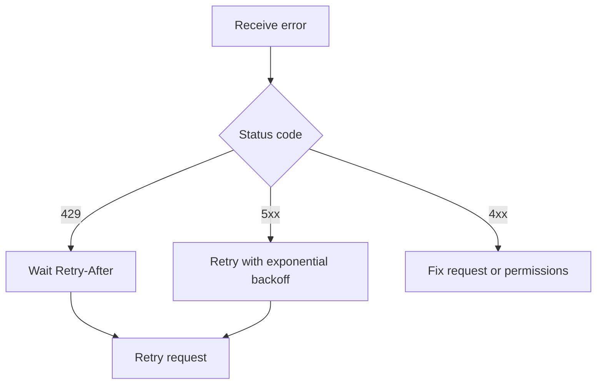

# Errors

The API uses conventional HTTP status codes and returns a structured error body.

```json
{
  "error": {
    "code": "mission_not_found",
    "message": "No mission with ID ORB-999 exists in this workspace.",
    "doc_url": "https://docs.orbitly.example.com/api-reference/errors"
  }
}
```

## Status codes

| Code | Meaning | Retry? |
| ---- | ------- | ------ |
| `400` | Malformed request body or invalid parameters | No |
| `401` | Missing or invalid API token | No |
| `403` | Token valid but lacks permission for this resource | No |
| `404` | Resource does not exist or is not visible to you | No |
| `409` | Conflict, such as duplicate mission ID prefix | Sometimes |
| `422` | Validation failed; see `error.fields` for details | No |
| `429` | Rate limit exceeded; respect `Retry-After` | Yes |
| `500` | Something broke on our end | Yes |


Only retry `429` and `5xx` responses automatically. Retrying validation or permission errors usually creates more noise without fixing the request.


## Validation errors

`422` responses include a per-field breakdown:

```json
{
  "error": {
    "code": "validation_failed",
    "message": "One or more fields are invalid.",
    "fields": {
      "fuel": "must be one of: 1, 2, 3, 5, 8",
      "priority": "unknown value 'urgent'"
    }
  }
}
```

## Common error codes

<table data-view="cards">
  <thead>
    <tr>
      <th></th>
      <th></th>
    </tr>
  </thead>
  <tbody>
    <tr>
      <td><strong>`token_expired`</strong></td>
      <td>Rotate the token in Settings.</td>
    </tr>
    <tr>
      <td><strong>`workspace_suspended`</strong></td>
      <td>Resolve the billing issue or contact a workspace admin.</td>
    </tr>
    <tr>
      <td><strong>`mission_locked`</strong></td>
      <td>The mission is in a closed launch window. Reopen the window or create a follow-up mission.</td>
    </tr>
    <tr>
      <td><strong>`plan_limit_reached`</strong></td>
      <td>Upgrade the plan or archive unused projects.</td>
    </tr>
  </tbody>
</table>

## Retry pattern


