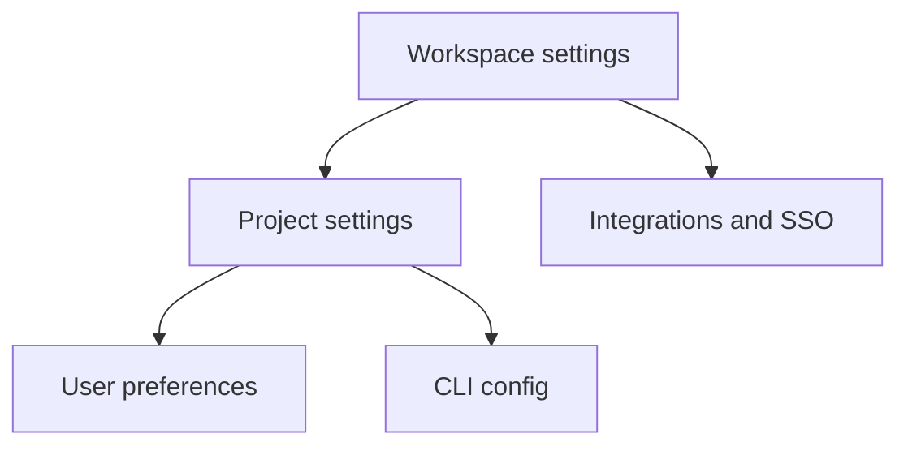

# Configuration

Orbitly configuration is layered. Workspace settings define shared defaults, project settings shape how teams work, and user preferences control personal notifications.



## Workspace settings

Admins configure workspace-wide defaults under **Settings > Workspace**.

| Setting | What it controls | Recommended default |
| ------- | ---------------- | ------------------- |
| Default timezone | Launch window boundaries and report cutoffs | Team headquarters timezone |
| Work week | Days included in velocity and burndown | Monday to Friday |
| Mission ID prefix | Human-readable mission IDs | Short product or team prefix |
| SSO | SAML login and identity controls | Enterprise workspaces |


Set timezone and work week before importing historical work. Telemetry backfills based on these settings.


## Project settings

Each project has its own settings page for day-to-day workflow design.



### Workflow

* Board columns
* Done criteria
* Review requirements
* Default assignee rules



### Operations

* Mission templates
* Automations
* Slack channel mapping
* Telemetry configuration



## CLI configuration

The CLI reads from `~/.config/orbitly/config.toml`:

```toml
[core]
default_workspace = "acme-inc"
editor = "vim"

[output]
format = "table"   # table | json | csv
color = true

[aliases]
st = "mission list --mine --status open"
```

Environment variables override the config file.

| Variable | Purpose |
| -------- | ------- |
| `ORBITLY_TOKEN` | API token for authentication |
| `ORBITLY_WORKSPACE` | Default workspace slug |
| `ORBITLY_API_URL` | Override API base URL for self-hosted environments |

<details>
<summary>Example setup for a CI pipeline</summary>

```bash
export ORBITLY_WORKSPACE="acme-inc"
export ORBITLY_TOKEN="$ORBITLY_SERVICE_TOKEN"
orbitly mission list --status open --format json
```
</details>

## User preferences

Each user controls notifications under **Settings > Notifications**.

| Channel | Best for | Suggested setting |
| ------- | -------- | ----------------- |
| In-app | Daily work and reviews | Keep enabled |
| Slack DMs | Mentions and urgent blockers | Enable mentions only |
| Email digest | Summary and catch-up | Daily digest |
| Per-event email | Low-volume projects | Disable for busy teams |


Notification preferences do not change project visibility. They only control where Orbitly sends updates for work you can already access.

