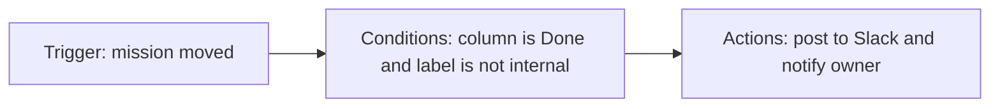

# Automations

Automations eliminate repetitive board management. Each automation is a **rule** made of a trigger, optional conditions, and one or more actions.


Automations are available on the Team plan and above. Explorer workspaces can create 1 automation per project as a trial.


## How rules work

Rules run in the order listed on the **Automations** page. A single event can match multiple rules, so keep names explicit and use conditions to avoid overlap.

## Automation library

<table data-view="cards">
  <thead>
    <tr>
      <th width="48"></th>
      <th></th>
      <th></th>
      <th data-hidden data-card-target data-type="content-ref"></th>
    </tr>
  </thead>
  <tbody>
    <tr>
      <td><i class="fa-list-check"></i></td>
      <td><strong>Rules and triggers</strong></td>
      <td>Every available trigger, condition, action, and execution behavior.</td>
      <td><a href="rules.md">rules</a></td>
    </tr>
    <tr>
      <td><i class="fa-wand-magic-sparkles"></i></td>
      <td><strong>Example recipes</strong></td>
      <td>Copy-paste workflows for bugs, launches, stale reviews, and reporting.</td>
      <td><a href="examples.md">examples</a></td>
    </tr>
  </tbody>
</table>

## Design checklist



## Start with one business outcome

Name the behavior clearly, such as "Escalate stale reviews" or "Notify launch channel when large work ships".



## Choose the narrowest trigger

Prefer a specific trigger like `Review requested` over a broad trigger like `Mission updated`.



## Add guardrail conditions

Filter by project, label, priority, team, or launch window so the rule fires only when it should.



## Test in history

Use **Automations > History** to confirm whether runs were executed, skipped, or failed.




Automations can trigger other automations, but chains are capped at 5 hops to prevent loops.

