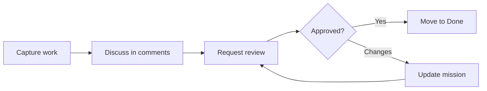

# Collaboration

Orbitly is built around shared work: missions, launch windows, reviews, and the context around them. The best teams use collaboration features to make ownership clear without creating notification noise.

## Collaboration model

## Comments and mentions

Every mission has a comment thread. Use `@name` to mention a teammate when you need action or context.

Comments support:

* Markdown formatting
* Code blocks
* File attachments up to 25 MB
* Links to other missions, projects, and launch windows


Use comments for decisions and durable context. Use chat tools for fast back-and-forth that does not need to live with the mission.


## Reviews

Use reviews when work needs explicit approval before it moves to Done.



## Request a review

Open the mission and click **Request Review**.



## Choose reviewers

Pick one or more teammates. Orbitly notifies them through their preferred channel.



## Resolve the decision

Reviewers can **Approve** or **Request Changes**. Missions with pending reviews show a review badge on the board.



## Shared views

Save filtered board views for recurring team workflows.

<table data-view="cards">
  <thead>
    <tr>
      <th></th>
      <th></th>
      <th></th>
    </tr>
  </thead>
  <tbody>
    <tr>
      <td><strong>My open missions</strong></td>
      <td>`assignee:me status:open`</td>
      <td>Personal execution view</td>
    </tr>
    <tr>
      <td><strong>This week's launches</strong></td>
      <td>`window:current status:done`</td>
      <td>Delivery review</td>
    </tr>
    <tr>
      <td><strong>Blocked work</strong></td>
      <td>`label:blocked`</td>
      <td>Team standup</td>
    </tr>
  </tbody>
</table>

## Notifications

By default, Orbitly notifies you when:

* You are mentioned or assigned
* A mission you own changes status
* A review is requested from you
* A mission you follow receives a new comment

Tune this per project under **Settings > Notifications**. For busy projects, use the **Daily Digest** and keep instant alerts for mentions and review requests only.

## Guest access

Invite clients, contractors, and external collaborators as **Guests**. Guests only see projects they are explicitly added to and never see workspace-level settings or member lists.


Before adding a guest, check that project templates, comments, and attachments do not include internal-only information.

