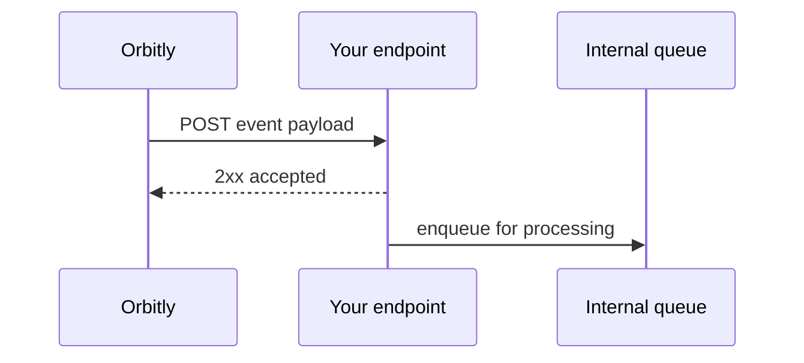

# Webhooks

Webhooks send real-time HTTP callbacks when things happen in Orbitly. Use them to update internal dashboards, trigger downstream systems, or store delivery events in your data warehouse.



## Create a webhook



## Open webhooks

Go to **Settings > Webhooks** and click **New Webhook**.



## Add the endpoint

Enter an HTTPS URL that can receive `POST` requests.



## Choose events

Subscribe to one or more event types, such as `mission.created` or `window.closed`.



## Save the secret

Use the generated secret to verify every delivery signature.



## Event types

| Event | Fired when |
| ----- | ---------- |
| `mission.created` | A new mission is created |
| `mission.updated` | Any mission field changes |
| `mission.status_changed` | A mission moves between columns |
| `window.opened` | A launch window starts |
| `window.closed` | A launch window ends |
| `comment.created` | A comment is posted |

## Payload format

```json
{
  "event": "mission.status_changed",
  "timestamp": "2026-07-02T14:30:00Z",
  "workspace": "acme-inc",
  "data": {
    "mission_id": "ORB-142",
    "title": "Redesign checkout flow",
    "from_status": "in_progress",
    "to_status": "done",
    "actor": "usr_8f3ka92"
  }
}
```

## Verify signatures

Every request includes an `X-Orbitly-Signature` header. It is an HMAC-SHA256 digest of the raw request body using your webhook secret.



```python
import hmac
import hashlib

def verify(body: bytes, signature: str, secret: str) -> bool:
    expected = hmac.new(secret.encode(), body, hashlib.sha256).hexdigest()
    return hmac.compare_digest(expected, signature)
```



```javascript
import crypto from "node:crypto";

export function verify(body, signature, secret) {
  const expected = crypto
    .createHmac("sha256", secret)
    .update(body)
    .digest("hex");

  return crypto.timingSafeEqual(Buffer.from(expected), Buffer.from(signature));
}
```




Verify the raw request body before parsing JSON. Re-serializing parsed JSON can change whitespace and produce a different signature.


## Retries

Failed deliveries are retried with exponential backoff.

| Attempt | Delay |
| ------- | ----- |
| 1 | 1 minute |
| 2 | 5 minutes |
| 3 | 30 minutes |
| 4 | 2 hours |
| 5 | 12 hours |

After 5 failures, Orbitly pauses the webhook and notifies workspace admins.
