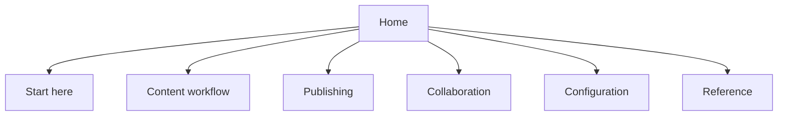

# Page

Use this page as the main reference for testing GitBook content, collaboration, publishing, and AI-ready documentation patterns.


This is a sandbox page. It should be useful enough to test real workflows, but it should not contain production-only secrets, customer data, or private internal information.


## What this site is for

The Jei Test Site is a safe place to validate how GitBook behaves before applying a workflow to a real docs site.

| Test area | What to validate |
| --- | --- |
| Content structure | Pages are easy to scan and navigate. |
| Collaboration | Comments and change requests are easy to review. |
| Publishing | Share links and preview URLs work as expected. |
| Permissions | Members have the right level of access. |
| AI search | Pages produce clear, grounded answers. |
| MCP readiness | Content is structured enough for tools and agents to retrieve. |

## Recommended workflow



### Draft the content

Start with one clear reader goal. Write enough detail for the reader to complete the task without guessing.



### Organize the page

Use headings for the main decisions or steps. Use tables for comparisons, hints for important caveats, and steppers for workflows with three or more steps.



### Request feedback

Use comments for local edits and change requests for groups of related changes. Keep each review focused on one outcome.



### Preview before publishing

Check navigation, links, formatting, and search behavior in preview before publishing the site.



### Share safely

Use share-link access while this remains a test site. Publish publicly only when the content is intentionally production-ready.



## Suggested information architecture

Keep the navigation broad and task-based. Readers should not have to understand the internal setup of the site to find the right page.

## Content standards

| Standard | Good example |
| --- | --- |
| Start with the reader goal | "Use this page to test publishing and share links." |
| Keep paragraphs short | One idea per paragraph. |
| Use stable terminology | Pick one name for each concept and reuse it. |
| Put warnings near the risky step | Access warnings belong in the publishing flow, not at the bottom. |
| Link related pages | Do not make readers search for the next step. |


Avoid placeholder pages. Empty or vague pages make search and AI answers worse because they add low-quality retrieval candidates.


## Publishing and access

For this sandbox, the safest publishing model is:

| Setting | Recommendation |
| --- | --- |
| Site visibility | Share-link while testing. |
| Default section | Home or the most complete test space. |
| Draft content | Keep unfinished sections in draft. |
| External review | Share one focused URL and ask for specific feedback. |
| Public indexing | Keep off until the content is meant to be discoverable. |

## Collaboration model

Use the smallest role that lets someone do their job.

| Role | Best use |
| --- | --- |
| Admin | Site setup, permissions, publishing, and configuration. |
| Creator | Creating spaces and larger content areas. |
| Editor | Writing and maintaining pages. |
| Reviewer | Approving change requests. |
| Commenter | Giving feedback without editing. |
| Reader | Viewing only. |

## AI search and MCP readiness

AI and MCP-style retrieval work best when pages are explicit, consistent, and complete.

Checklist:

* Use direct headings that match reader questions.
* Define key terms once.
* Keep procedures step-based.
* Put caveats next to the action they affect.
* Use examples where mistakes are likely.
* Remove or hide unfinished content.

## Next improvements

Good next tests for this site:

1. Add one real product or project page.
2. Add a short FAQ with questions a new user would actually ask.
3. Test a change request from draft to merge.
4. Publish behind a share link and open it in a clean browser.
5. Try GitBook AI search against this page and refine weak answers.
