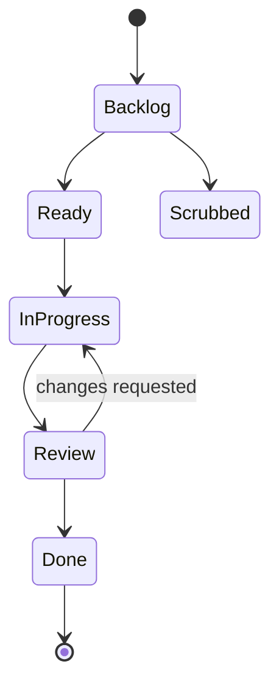

# Glossary

Use this glossary when reading Orbitly docs, reviewing analytics, or building integrations.

## Product model

| Term | Definition |
| ---- | ---------- |
| **Workspace** | Top-level container for all projects, members, and settings |
| **Project** | A workspace area that contains missions, workflows, views, automations, and telemetry |
| **Mission** | A single unit of work, similar to a task or ticket |
| **Sub-mission** | A child task nested under a parent mission |
| **Guest** | External collaborator with access limited to specific projects |
| **Service account** | A non-human member used for API automations |

## Workflow terms

| Term | Definition |
| ---- | ---------- |
| **Launch window** | A time-boxed sprint; unfinished missions roll over when it closes |
| **Fuel** | Effort estimate in points: 1, 2, 3, 5, or 8 |
| **Scrubbed** | A cancelled mission, excluded from all metrics |
| **Review** | A required approval step before work can be marked Done |
| **Shared view** | A saved filter visible to project members |

## Telemetry terms

| Term | Definition |
| ---- | ---------- |
| **Telemetry** | Orbitly's reporting suite: velocity, burndown, cycle time, and cumulative flow |
| **Velocity** | Total fuel completed per launch window, averaged over the last 3 windows |
| **Cycle time** | Time from a mission entering In Progress to reaching Done |
| **Burndown** | Remaining fuel in the current launch window over time |
| **Cumulative flow** | A chart showing mission counts by workflow column over time |

## API terms

| Term | Definition |
| ---- | ---------- |
| **Live token** | API token for production workspaces |
| **Test token** | API token for sandbox workspaces |
| **Webhook** | An HTTP callback sent when an Orbitly event occurs |
| **Rate limit** | The maximum number of API requests allowed per minute |

How Orbitly work moves through a project

