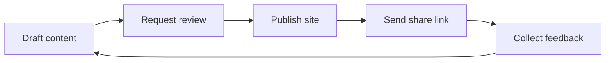

# Jei Test Site

Use this space to test how GitBook handles structured docs, reviews, publishing, permissions, AI search, and MCP-ready content.


This is a GitBook-branded test environment owned by <code class="expression">space.vars.owner</code>. Treat it as a sandbox for trying workflows before applying them to customer-facing or internal production docs.


## Brand system

| Element | Applied style |
| --- | --- |
| Primary color | GitBook orange `#F25B3A` |
| Base tone | GitBook dark base `#1C1917` |
| Surfaces | GitBook grey range for muted backgrounds and borders |
| Logo treatment | GitBook-style wordmark, scaled uniformly and kept high contrast |

<table data-view="cards"><thead><tr><th></th><th></th><th></th><th data-hidden data-card-target data-type="content-ref"></th></tr></thead><tbody>
<tr>
  <td><h3><i class="fa-rocket" style="color:$primary;">:rocket:</i></h3></td>
  <td><strong>Quickstart</strong></td>
  <td>Make a small edit, request review, and publish safely.</td>
  <td><a href="start-here/quickstart.md">quickstart</a></td>
</tr>
<tr>
  <td><h3><i class="fa-sitemap" style="color:$primary;">:sitemap:</i></h3></td>
  <td><strong>Site map</strong></td>
  <td>Understand how this test site is organized.</td>
  <td><a href="start-here/site-map.md">site-map</a></td>
</tr>
<tr>
  <td><h3><i class="fa-pen-nib" style="color:$primary;">:pen_nib:</i></h3></td>
  <td><strong>Writing standards</strong></td>
  <td>Keep pages scannable, consistent, and useful.</td>
  <td><a href="content-workflow/writing-standards.md">writing-standards</a></td>
</tr>
<tr>
  <td><h3><i class="fa-lock" style="color:$primary;">:lock:</i></h3></td>
  <td><strong>Access model</strong></td>
  <td>Review visibility, share links, and member permissions.</td>
  <td><a href="publishing/share-links-and-access.md">share-links-and-access</a></td>
</tr>
</tbody></table>

## Recommended test flow

## What to validate

| Area | What good looks like |
| --- | --- |
| Navigation | Readers can find the right page in two clicks. |
| Review | Draft changes are clear and easy to approve. |
| Publishing | Share links work without exposing the site publicly. |
| Search | Important concepts are written in language people would search for. |
| MCP readiness | Pages have clear headings, stable terminology, and concise answers. |
