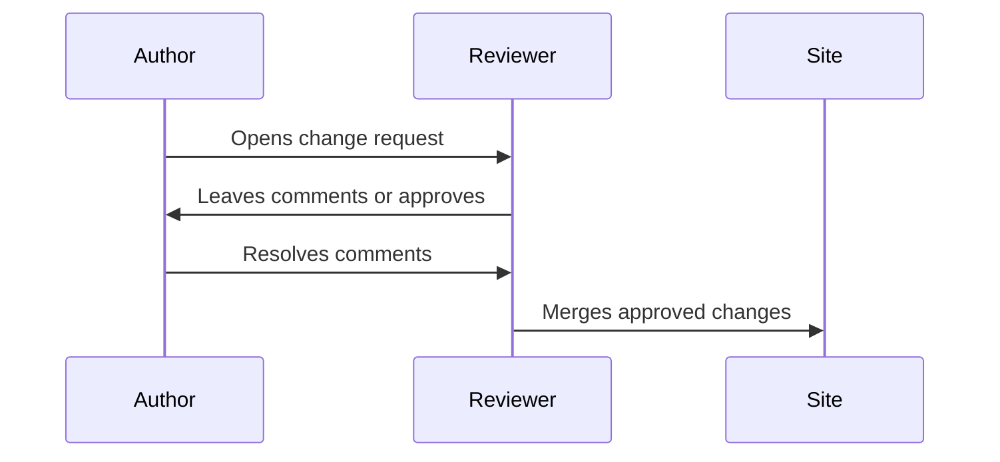

# Review process

Use change requests when edits should be reviewed before publishing.

## Review checklist

| Check | Pass criteria |
| --- | --- |
| Purpose | The page has one clear reader goal. |
| Navigation | The page is linked from the right section. |
| Accuracy | Claims are specific and current. |
| Links | Internal and external links open correctly. |
| Search | The page uses terms a reader would search for. |

## Reviewer notes

Reviewers should focus on clarity, correctness, and findability. Save style preferences for patterns that will repeat across the site.
